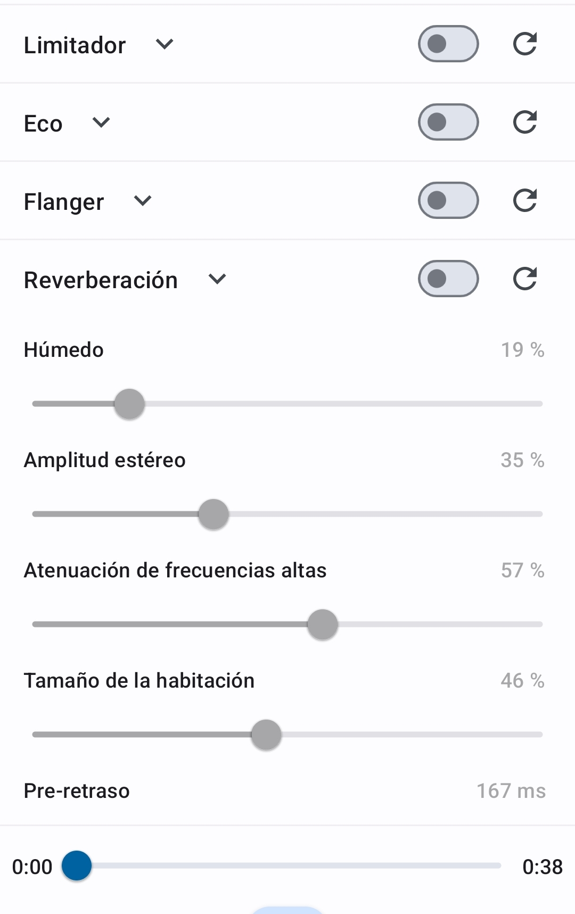

## [Music Speed Changer](https://app.musicspeedchanger.com/)
        
- Cambiar velocidad con mínima distorsión.
- Ajustar el tono hasta cents de semitono.
    - Ejemplo:
        - Con [YouTube](https://www.youtube.com/watch?v=lrJrlsAU3AQ)
        - Con [MSC](https://app.musicspeedchanger.com/): (`ellayjoe.mp3`)

---

## Otras posibilidades de MSC

- Separador de pistas.
- Seleccionar y recortar bucles.
- Establecer localizadores o marcadores.
    - (para ensayar secciones de obras extensas)
- Grabadora.
- EQ, compresor, reverb...

---

### MSC (3)

    - Aplicación: motivación del alumnado

---

## Otras aplicaciones conocidas

### [Soundslice](https://www.soundslice.com/)

- Crear partituras sincronizadas con vídeos de YouTube.
- Ejemplo de [partitura](https://www.soundslice.com/slices/J1qMc/edit/)

---

### [melody.ml](https://melody.ml/) ([Spleeter](https://github.com/deezer/spleeter))

- Separador de pistas:
    - separa voz, e instrumentos:
        - Voz y acompañamiento
        - Voz, percusión, bajo y otros
    - Útil para música moderna y crear pistas de acompañamiento

---

## Otras aplicaciones menos conocidas

- [Sonic Visualizer](https://www.sonicvisualiser.org/)
    - Transcripción de audio a MIDI: `sonicnatureboy.mp4`

- [Tony](https://code.soundsoftware.ac.uk/projects/tony/wiki)
    - Transcripción de melodía: `debla.mp3`, `debla.mp4`.    

¿Un melodyne gratuito?

---

### [Virtuosity](https://f-droid.org/en/packages/ca.ramzan.virtuosity/)

Temporizador de estudio y registro de progreso.

- [] TODO: fit image to slide

---

    

---

## SoundCool

- Creación audiovisual colaborativa
    - [Muestra](https://www.youtube.com/watch?v=z1SYV-Jw9es)
    - Aplicación: hacer la creación audiovisual accesible en el aula, usando un teléfono móvil como principal herramienta.

---

### ¿Dudas, sugerencias, críticas, aportaciones?

